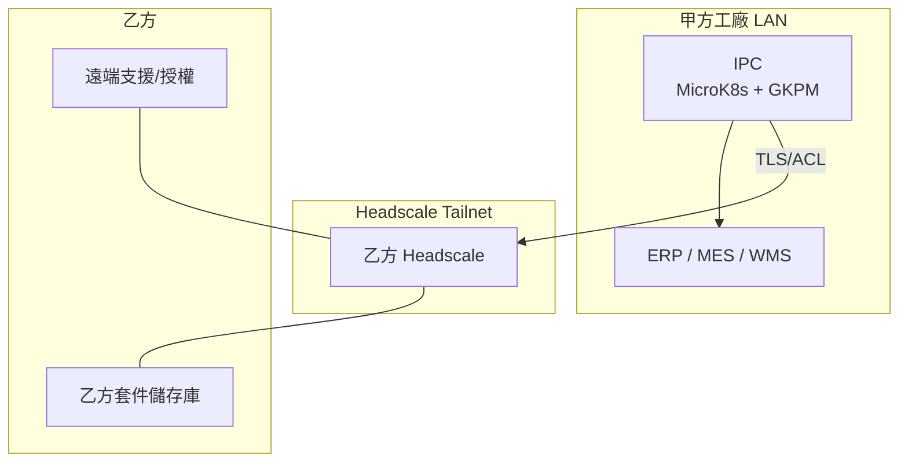
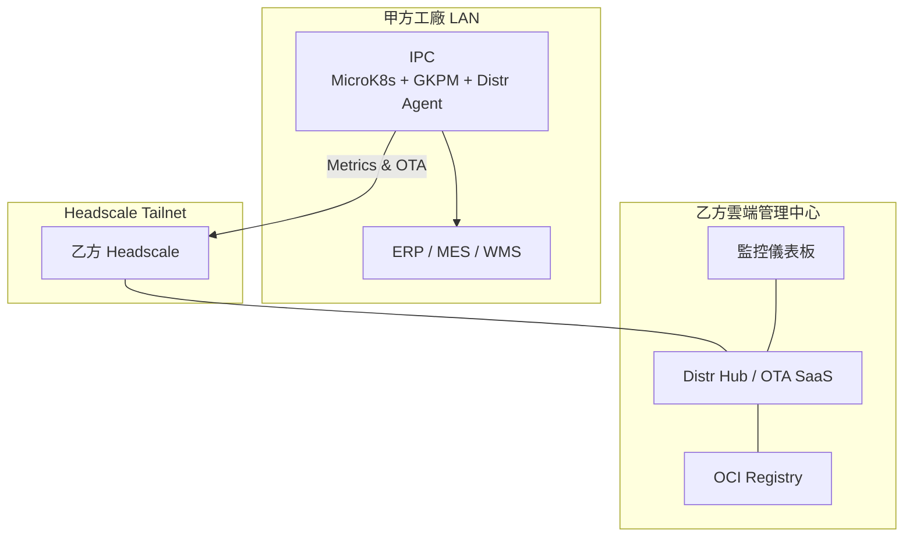
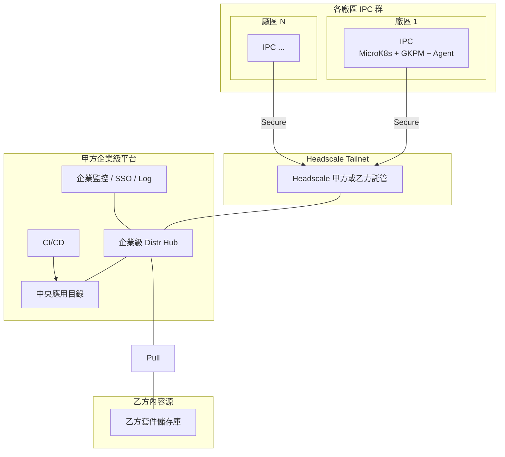

# **IEPMP：分層解決方案設計 (小型、中型、大型工廠)**

本文件旨在詳細闡述智慧邊緣工業電腦管理平台 (IEPMP) 針對不同規模工廠客戶的三種分層解決方案。這些方案旨在滿足客戶在應用程式管理、遠端連接、自主性及擴展性等方面的不同需求。

**核心技術基石 (所有方案共享)：**

* **硬體：** 標準化 IEPMP 工業電腦 (IPC)。  
* **作業系統：** 優化的 Linux 發行版。  
* **地端編排：** 每台 IPC 內建 MicroK8s。  
* **本地應用管理：** 每台 IPC 內建 Glasskube Kubernetes 套件管理器 (GKPM)。  
* **安全連接基礎：** Headscale (由乙方或大型甲方自建/管理) 用於建立安全的 Tailscale 覆蓋網路。  
* **標準化打包：** 所有應用程式 (甲方自研、乙方出廠、開源) 均採用容器化 (Docker) 並打包為 Helm charts 或 Glasskube packages。

## **解決方案一：IEPMP Essentials (小型工廠適用)**

### **1\. 方案名稱/層級**

IEPMP Essentials (基礎版)

### **2\. 目標客戶畫像 (適用情境)**

* **規模：** 單一廠區或少數 IPC 部署的小型製造企業。  
* **IT/OT 能力：** 有限的專職 IT/OT 人員，傾向於簡單易用的工具，對複雜的雲端管理平台需求不高。  
* **自主性需求：** 希望對本地 IPC 上的應用程式有較高的控制權，能夠自主管理更新節奏。  
* **網路環境：** IPC 可連接甲方內部網路 (ERP/MES/WMS)，並允許 IPC 單向對外連接至乙方的 Headscale 伺服器以獲取套件更新資訊或進行基礎遠端支援 (在甲方許可下)。不傾向或不具備讓乙方進行深度遠端代管的能力。  
* **應用複雜度：** 主要運行乙方的核心應用、少量甲方二次開發應用及基礎開源軟體。

### **3\. 核心架構與關鍵元件**

* **IPC 端：**  
  * MicroK8s \+ GKPM (核心)  
  * Tailscale 客戶端 (連接至乙方 Headscale)  
  * 乙方核心應用 (Glasskube package/Helm chart)  
  * 甲方二次開發應用 (Glasskube package/Helm chart)  
  * 開源應用 (Glasskube package/Helm chart)  
* **乙方端：**  
  * **Headscale 伺服器：** 乙方維護，用於建立安全的 Tailscale 網路。  
  * **乙方應用程式套件儲存庫 (Package Repository)：** 乙方維護一個安全的儲存庫 (例如，簡單的 HTTP 伺服器、GitHub Releases、或基礎的 OCI 註冊表)，存放其核心應用的 Glasskube packages 或 Helm charts。此儲存庫的位址可透過 Headscale 安全地提供給甲方的 GKPM。  
* **甲方端：**  
  * **內部網路：** IPC 連接至此，與 ERP/MES/WMS 通訊。  
  * **(選擇性) 甲方內部套件儲存庫：** 若甲方有二次開發需求，可自行建立簡單的內部儲存庫 (如 Git repo 存放 Glasskube YAMLs 或 Helm charts)。

### **4\. 應用程式生命週期管理**

* **乙方應用程式更新：**  
  1. **打包與發布 (乙方)：** 乙方將其核心應用程式打包為 Glasskube package 或 Helm chart，並發布到其**乙方應用程式套件儲存庫**。  
  2. **更新通知/拉取 (甲方)：**  
     * **手動/半自動：** 乙方通知甲方有新版本。甲方 IT/OT 人員在 IPC 上使用 GKPM CLI (或本地 UI)，從已設定的乙方儲存庫 (位址透過 Headscale 安全獲取或預設配置) 拉取並安裝更新。  
     * **GKPM 自動檢查 (若配置)：** GKPM 可配置為定期檢查乙方儲存庫是否有新版本 (需 IPC 能透過 Headscale 安全訪問該儲存庫)。  
* **甲方二次開發應用程式管理：**  
  1. **開發與打包 (甲方)：** 甲方開發容器化應用，打包為 Glasskube package/Helm chart。  
  2. **部署 (甲方)：** 甲方可將套件存放於內部檔案共享、Git 儲存庫，或簡易 HTTP 伺服器。然後在 IPC 上使用 GKPM 從這些來源安裝/更新。  
* **開源應用程式管理：**  
  1. **來源：** 可來自乙方提供的精選套件 (存放於乙方儲存庫)，或甲方從公共儲存庫獲取並自行管理的套件。  
  2. **部署與更新 (甲方)：** 使用 GKPM 在 IPC 本地進行安裝、設定和更新。

### **5\. 乙方的角色與責任**

* 維護 Headscale 伺服器。  
* 開發、打包並安全地發布其核心應用程式的更新套件到**乙方應用程式套件儲存庫**。  
* 提供清晰的更新說明和版本資訊。  
* 提供 IEPMP 平台本身 (OS, MicroK8s, GKPM, Tailscale 客戶端) 的基礎更新機制或指南。  
* 透過 Headscale 提供遠端支援 (在甲方明確授權和協助下，例如螢幕共享或指導操作)。

### **6\. 甲方的角色與責任**

* 負責 IPC 的日常實體與網路安全。  
* 負責其內部網路的配置，確保 IPC 能連接 ERP/MES/WMS。  
* **主導**乙方核心應用程式的更新時程與執行 (透過 GKPM 從乙方儲存庫拉取)。  
* 全權負責其二次開發應用程式的開發、打包、部署與更新。  
* 管理 IPC 上開源應用程式的部署與更新。  
* 監控 IPC 及應用程式的本地運行狀態。

### **7\. 主要效益**

* **甲方高度自主：** 甲方完全控制更新時機和應用部署。  
* **簡單易用：** GKPM 簡化本地應用管理。  
* **安全基礎：** Headscale 提供安全的遠端支援通道基礎，但主要更新流程由甲方發起。  
* **成本效益：** 方案架構相對簡單，適合預算有限的小型企業。

### **8\. 解決的痛點**

* 解決了小型工廠缺乏專業 K8s 管理人員，但仍需運行容器化應用的問題。  
* 提供了比手動 SSH \+ kubectl apply 更標準化、更安全的應用管理方式。  
* 乙方能以標準化方式提供軟體，減少因客戶環境各異導致的支援問題。

### **9\. 連接模型總結**

* IPC \<-\> 甲方內部網路 (ERP/MES/WMS)  
* IPC \-\> (Headscale) \-\> 乙方套件儲存庫 (用於甲方拉取乙方應用更新)  
* IPC \<- (Headscale，甲方授權下) \<- 乙方遠端支援

## **解決方案二：IEPMP Advanced (中型工廠適用)**

### **1\. 方案名稱/層級**

IEPMP Advanced (進階版)

### **2\. 目標客戶畫像 (適用情境)**

* **規模：** 擁有多台 IPC 的單一或少數廠區的中型製造企業。  
* **IT/OT 能力：** 擁有一定的 IT/OT 人員，但可能仍希望將部分應用程式 (尤其是乙方核心應用) 的管理和更新責任部分或完全交由乙方處理，以專注於核心業務。  
* **自主性需求：** 希望對甲方自研應用有控制權，但對乙方核心應用的更新和監管持開放態度，甚至期望乙方提供主動式服務。  
* **網路環境：** IPC 可穩定連接甲方內部網路，並且可以透過 Headscale 安全地單向對外連接至乙方的雲端管理中心 (例如 Distr Hub 或類似的 SaaS 平台)。甲方允許乙方在此安全通道下進行 OTA 更新和遠端監管。  
* **應用複雜度：** 運行乙方的核心應用、一定數量的甲方二次開發應用以及多種開源軟體，對穩定性和即時更新有較高要求。

### **3\. 核心架構與關鍵元件**

* **IPC 端：**  
  * MicroK8s \+ GKPM  
  * Tailscale 客戶端 (連接至乙方 Headscale)  
  * **Distr 代理程式 (或乙方自研代理程式)：** 核心元件，負責與乙方雲端管理中心通訊，接收指令，執行 OTA 更新，上傳遙測數據。  
  * 乙方核心應用 (由 Distr 代理程式透過 GKPM 管理)  
  * 甲方二次開發應用 (由甲方透過 GKPM 管理)  
  * 開源應用 (可由 Distr 代理程式或甲方 GKPM 管理)  
* **乙方端：**  
  * **Headscale 伺服器：** 乙方維護。  
  * **乙方雲端管理中心 (例如，乙方自建/SaaS 的 Distr Hub)：**  
    * 應用程式儲存庫 (OCI Registry for Glasskube packages/Helm charts)。  
    * IPC 機群管理與監控儀表板。  
    * OTA 更新排程與執行控制。  
    * 授權管理。  
    * (選擇性) 遠端診斷與日誌收集。  
* **甲方端：**  
  * 內部網路。  
  * 甲方內部套件儲存庫 (用於甲方自研應用)。  
  * (選擇性) 存取乙方雲端管理中心的唯讀或有限權限帳號，以監控乙方應用狀態。

### **4\. 應用程式生命週期管理**

* **乙方應用程式更新 (OTA)：**  
  1. **打包與發布 (乙方)：** 乙方將應用打包並發布到其**雲端管理中心 (Distr Hub)**。  
  2. **OTA 更新執行 (乙方主導，透過代理程式)：**  
     * 乙方透過其雲端管理中心排程或觸發更新。  
     * IPC 上的 **Distr 代理程式**透過 Headscale 安全通道從管理中心接收更新指令和套件。  
     * Distr 代理程式調用本地 **GKPM** 執行應用程式的安裝/升級。  
     * 更新狀態回報給乙方管理中心。  
* **甲方二次開發應用程式管理：**  
  1. **開發、打包、發布 (甲方)：** 甲方將其應用發布到其**內部套件儲存庫**。  
  2. **部署與更新 (甲方主導)：** 甲方 IT/OT 人員使用 IPC 上的 GKPM CLI/UI 從其內部儲存庫安裝/更新甲方應用。此過程獨立於乙方的 OTA 更新。  
* **開源應用程式管理：**  
  * **乙方管理：** 若開源應用是乙方核心應用的依賴，或乙方提供精選的開源套件，則可透過 Distr 代理程式進行 OTA 更新。  
  * **甲方管理：** 甲方也可選擇自行透過 GKPM 從內部或公共儲存庫管理部分開源應用。

### **5\. 乙方的角色與責任**

* 維護 Headscale 伺服器和**乙方雲端管理中心 (Distr Hub)**。  
* 負責其核心應用程式的開發、打包、測試、發布以及**主動的 OTA 更新**。  
* 透過雲端管理中心監控乙方應用在客戶 IPC 上的運行狀態、版本等。  
* 提供 IEPMP 平台本身的 OTA 更新。  
* 提供進階的遠端支援和故障排除服務 (透過 Headscale 和代理程式收集的資訊)。  
* 管理乙方應用的授權。

### **6\. 甲方的角色與責任**

* 確保 IPC 的網路連接暢通 (對內連接工廠系統，對外透過 Headscale 連接乙方管理中心)。  
* 管理其內部網路安全。  
* 全權負責其二次開發應用程式的生命週期管理 (透過內部儲存庫和本地 GKPM)。  
* (選擇性) 監控乙方雲端管理中心提供的儀表板。  
* 與乙方協調維護窗口 (若 OTA 更新可能影響生產)。  
* 管理其自選的開源應用程式 (若未由乙方統一管理)。

### **7\. 主要效益**

* **平衡自主與託管：** 甲方保留對自研應用的控制，同時享受乙方專業的核心應用管理和 OTA 更新服務。  
* **提高效率：** 乙方 OTA 更新減少了甲方的人工介入。  
* **主動式維護：** 乙方可主動監控其應用狀態，潛在問題可提早發現。  
* **增強安全性：** 所有遠端操作均在 Headscale 保護的安全通道內進行。

### **8\. 解決的痛點**

* 解決了中型工廠 IT/OT 資源有限，難以應對日益複雜的邊緣應用管理和頻繁更新的問題。  
* 降低了因手動更新不及時或操作失誤導致的生產風險。  
* 為乙方提供了更高效、更具擴展性的客戶支援和軟體維護模式。

### **9\. 連接模型總結**

* IPC \<-\> 甲方內部網路 (ERP/MES/WMS)  
* IPC \<-\> (Headscale) \<-\> 乙方雲端管理中心 (Distr Hub) (用於乙方應用 OTA 更新、監管、遙測)  
* IPC \-\> 甲方內部套件儲存庫 (用於甲方拉取自研應用更新)

## **解決方案三：IEPMP Enterprise (大型/跨國工廠適用)**

### **1\. 方案名稱/層級**

IEPMP Enterprise (企業版)

### **2\. 目標客戶畫像 (適用情境)**

* **規模：** 擁有多個廠區 (可能跨國) 的大型製造企業，IPC 部署數量龐大。  
* **IT/OT 能力：** 擁有強大的中央 IT/OT 團隊，具備自行管理大規模邊緣基礎設施的能力和意願，可能已有或計劃建立企業級的軟體分發和設備管理平台。  
* **自主性需求：** 對整個邊緣應用生態系統 (包括乙方應用、甲方自研應用、開源應用) 的生命週期管理、安全性、合規性有極高的控制要求。  
* **網路環境：** 各廠區 IPC 連接各自的內部網路。各廠區 IPC 可透過 Headscale (可能由甲方自建/管理，或乙方提供專用/聯邦實例) 安全地單向對外連接至甲方或乙方的中央管理/分發平台。  
* **應用複雜度：** 應用種類繁多，版本控制複雜，對標準化、自動化、可稽核性有極高要求。可能需要整合企業現有的身份驗證、日誌、監控系統。

### **3\. 核心架構與關鍵元件**

* **IPC 端：**  
  * MicroK8s \+ GKPM  
  * Tailscale 客戶端 (連接至甲方或乙方的 Headscale)  
  * **Distr 代理程式 (或甲方選擇的標準化代理程式)：** 與中央分發平台通訊。  
  * 所有應用 (乙方、甲方、開源) 的部署和更新都可能由中央平台透過代理程式下發指令給本地 GKPM 執行。  
* **乙方端：**  
  * **Headscale 伺服器：** (若甲方未自建，則由乙方提供，可能需支援聯邦認證)。  
  * **乙方應用程式套件儲存庫/Distr Hub (作為內容源)：** 乙方將其驗證過的應用程式 (Glasskube packages/Helm charts) 發布到此處，供甲方的中央分發平台拉取或同步。乙方主要角色是「內容提供商」。  
* **甲方端 (核心)：**  
  * **(選擇性) 甲方自建/管理的 Headscale 伺服器：** 用於統一管理所有 IPC 的安全網路存取。  
  * **甲方企業級軟體分發與管理平台 (例如，甲方自建/SaaS 的 Distr Hub 實例，或整合現有如 Rancher, OpenShift 等平台)：**  
    * 中央應用程式目錄/儲存庫 (可同步乙方的套件，並包含甲方自研和精選開源套件)。  
    * 跨廠區 IPC 機群管理、組態管理、部署策略。  
    * 集中的版本控制、更新排程與審批流程。  
    * 與企業 SSO、日誌、監控、告警系統整合。  
  * 甲方內部 CI/CD 管線，將甲方自研應用發布到其中央應用程式目錄。

### **4\. 應用程式生命週期管理**

* **統一生命週期管理 (甲方主導，透過中央平台)：**  
  1. **套件獲取與聚合 (甲方)：**  
     * **乙方應用：** 甲方的中央分發平台從**乙方的套件儲存庫/Distr Hub** 同步或拉取乙方發布的應用程式套件。甲方可在此基礎上進行額外的安全掃描或測試。  
     * **甲方自研應用：** 透過甲方內部 CI/CD 發布到其中央應用程式目錄。  
     * **開源應用：** 由甲方中央 IT/OT 團隊精選、測試、打包並納入其中央應用程式目錄。  
  2. **部署策略與排程 (甲方)：** 甲方透過其中央分發平台定義部署目標 (哪些廠區、哪些 IPC 群組)、版本、組態和更新策略 (例如，金絲雀發布、藍綠部署)。  
  3. **指令下發與執行 (透過代理程式與 GKPM)：**  
     * 中央分發平台透過 Headscale 安全通道向目標 IPC 上的 **Distr 代理程式 (或標準代理程式)** 下發部署/更新指令。  
     * 代理程式調用本地 **GKPM** 執行應用程式的安裝、升級或組態變更。  
  4. **狀態回報與集中監控 (甲方)：** 代理程式將執行狀態回報給甲方的中央分發平台，甲方可進行集中監控和稽核。

### **5\. 乙方的角色與責任**

* 作為**高品質應用程式套件的提供商**：專注於開發、測試、打包其核心應用，並以標準化格式 (Glasskube package/Helm chart) 發布到約定的儲存庫 (乙方 Distr Hub 或其他甲方可存取的源)。  
* 提供清晰的版本說明、相容性資訊和詳細的技術文件。  
* 配合甲方的中央管理平台進行必要的整合或 API 對接 (如果需要)。  
* 提供 IEPMP 平台本身 (OS, MicroK8s, GKPM, Tailscale 客戶端) 的更新包，供甲方納入其分發平台。  
* 提供專家級的二線或三線支援。

### **6\. 甲方的角色與責任**

* **全權負責**其企業內所有 IEPMP IPC 的應用程式生命週期管理、安全、合規和營運。  
* 建立和維護其**企業級軟體分發與管理平台** (或使用乙方提供的專用企業版 Distr 實例)。  
* (選擇性) 建立和維護企業級 Headscale 服務。  
* 定義企業範圍內的 IPC 組態標準、安全策略和更新流程。  
* 整合 IEPMP 管理與企業現有的 IT/OT 系統。  
* 負責所有應用程式 (包括從乙方獲取的) 在其環境中的最終測試和上線審批。  
* 管理跨國部署的網路連接和資料主權等問題。

### **7\. 主要效益**

* **集中化與規模化管理：** 甲方能夠對全球分佈的數百上千台 IPC 進行統一、高效的管理。  
* **高度客製化與控制：** 甲方可以根據自身複雜的業務需求和合規要求，深度客製化管理平台和流程。  
* **標準化與自動化：** 在企業層面推行標準化的應用打包、部署和更新流程，最大程度實現自動化。  
* **整合企業生態：** 與企業現有 IT 系統 (SSO, Logging, Monitoring) 深度整合。

### **8\. 解決的痛點**

* 解決了大型跨國企業在管理大規模、地理分散的邊緣設備時面臨的極端複雜性。  
* 滿足了大型企業對安全性、合規性、可稽核性和自主可控的嚴格要求。  
* 使大型企業能夠將邊緣計算能力標準化，並作為其整體數位化轉型戰略的一部分進行統一規劃和管理。

### **9\. 連接模型總結**

* IPC \<-\> 各廠區甲方內部網路 (ERP/MES/WMS)  
* IPC \<-\> (甲方/乙方 Headscale) \<-\> 甲方企業級軟體分發與管理平台 (Distr Hub 或同等平台)  
* 甲方企業級平台 \-\> 乙方套件儲存庫/Distr Hub (用於拉取乙方應用套件)

這三種分層解決方案為不同規模和需求的工廠客戶提供了靈活的選擇，同時確保了 IEPMP 平台的核心價值——安全、高效、標準化的邊緣應用管理。乙方可以根據客戶的成熟度和需求，引導他們選擇最合適的方案層級。